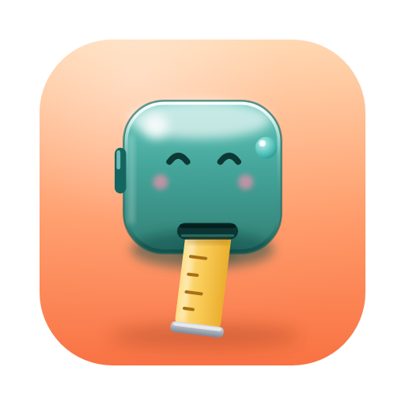

<p align="center">
  
</p>

<h1 align="center">Cubit</h1>

<p align="center">
  Show exactly how much of the screen a design wastes — draw a line or box, get the %, export a marked-up screenshot.
</p>

<p align="center">
  <a href="https://github.com/mtyroler/cubit/actions/workflows/ci.yml"></a>
  <a href="LICENSE"></a>
  
</p>

## Why

"How much of this screen is dead space?" comes up constantly in design review, QA, and bug reports, and the honest answer is usually a guess. Cubit turns it into a number: draw a rectangle or a line over anything on screen and it's expressed as a percentage of a window, a display, or a custom rectangle you define — live, as you draw. When you've got the measurement you want, export it as an annotated screenshot to drop into a ticket or a Slack thread.

## Features

- Global hotkey (⌃⌥⌘M by default, rebindable) freezes the screen and opens a full-screen measurement overlay
- Rectangle and horizontal/vertical line tools with a live HUD showing pixels and percent of the reference frame
- Reference frame is the window under your cursor by default; `Tab` cycles to full screen, or draw a custom reference rectangle
- Multiple simultaneous, color-coded measurements with editable labels, selection, nudge/resize, and undo
- Export a designed annotated PNG — callout pills, leader lines, and a legend card — via save, copy, or drag-out
- Optional metadata footer on exports (machine name, window title, app name) — all off by default
- Menu-bar-first UX (no Dock icon) with a Settings window for shortcuts, appearance, and export defaults
- Zero third-party dependencies

## Install

1. Download the latest `Cubit-vX.Y.Z.zip` from the [Releases](https://github.com/mtyroler/cubit/releases) page and unzip it.
2. Move `Cubit.app` to `/Applications` (or wherever you like).
3. Cubit is ad-hoc signed, not notarized, so Gatekeeper will refuse to open it with a plain double-click. Either:
   - Right-click `Cubit.app` → **Open** → confirm in the dialog that appears (only needed once), or
   - Strip the quarantine flag from Terminal: `xattr -dr com.apple.quarantine /Applications/Cubit.app`
4. On first use, Cubit will ask for **Screen Recording** permission — it's required to freeze the screen for measuring and to capture the image you export. Cubit walks you through the System Settings prompt; nothing is captured until you grant it.

## Usage

Press the hotkey to freeze the screen and open the overlay, then:

| Action | Shortcut |
| --- | --- |
| Open/close measurement overlay | `⌃⌥⌘M` (rebindable in Settings) |
| Rectangle tool | `R` |
| Horizontal line tool | `H` |
| Vertical line tool | `V` |
| Cycle reference frame (window → screen → custom) | `Tab` |
| Draw a custom reference rectangle | `C` |
| Constrain to square / center-out draw | hold `Shift` / `⌥` while dragging |
| Nudge selected measurement | arrow keys (hold `Shift` for 10px steps, `⌥` to resize instead of move) |
| Undo | `⌘Z` |
| Delete selected measurement | `Delete` |
| Open export menu | `⌘E` |
| Save export as PNG | `⌘S` |
| Copy export to clipboard | `⌘C` |
| Close menu / deselect / cancel / dismiss overlay | `Esc` |

## Demo

<!-- TODO: replace with a real screen recording of Cubit in action -->

## Privacy

Cubit doesn't talk to the network — nothing you measure, capture, or export leaves your Mac. The optional metadata footer on exports (machine name, window title, app name) is off by default and only ever writes into the image file you choose to save or copy.

Cubit is unsandboxed. It needs system-wide window and screen information (via `CGWindowList` and system-wide screen capture) to detect the window under your cursor and freeze the whole screen for measuring, which the App Sandbox doesn't permit for third-party apps.

## Building from source

Requires Xcode 26 or later.

```sh
git clone https://github.com/mtyroler/cubit.git
cd cubit
open Cubit.xcodeproj
```

Or from the command line:

```sh
xcodebuild -scheme Cubit -destination 'platform=macOS' build test
```

## Contributing

See [CONTRIBUTING.md](CONTRIBUTING.md).

## License

MIT — see [LICENSE](LICENSE).
