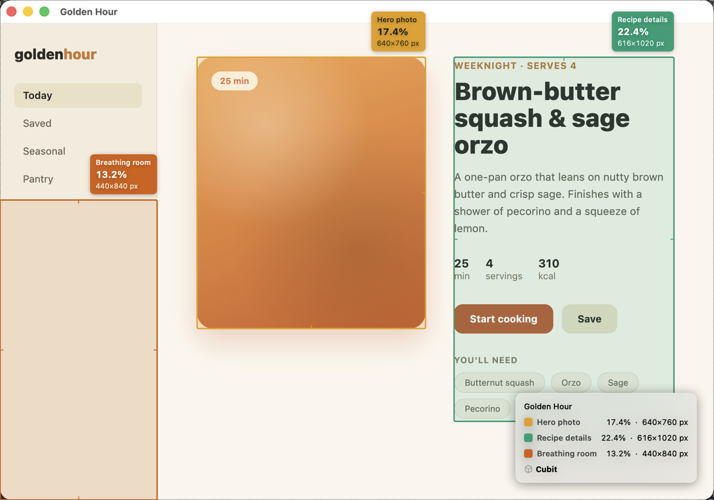
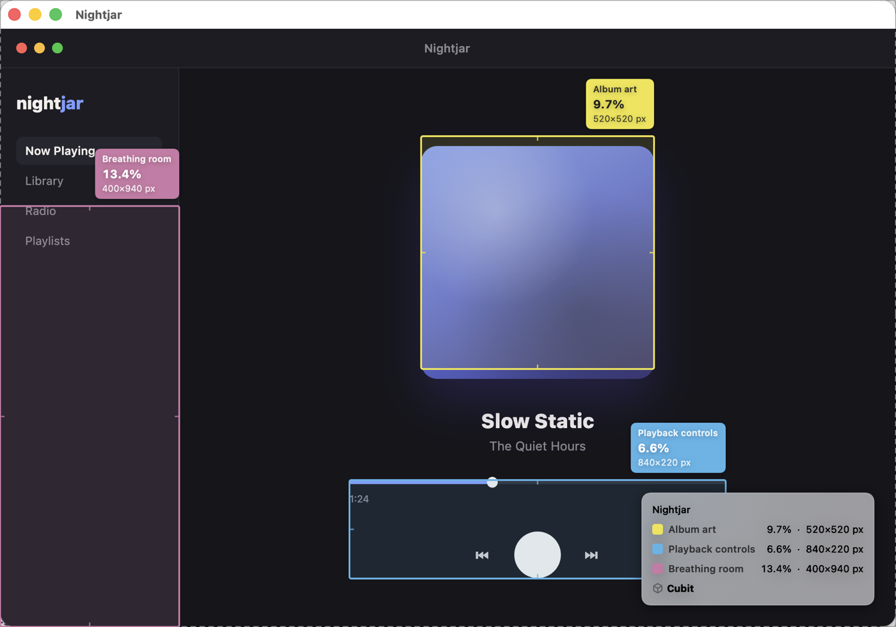
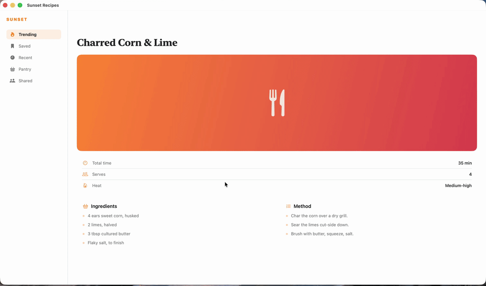

<p align="center">
  
</p>

<h1 align="center">Cubit</h1>

<p align="center">
  Know exactly how much room your design gives its content. Draw a box, get the percentage.
  <br>
  For you, and for your agent.
</p>

<p align="center">
  <a href="https://github.com/mtyroler/cubit/actions/workflows/ci.yml"></a>
  <a href="LICENSE"></a>
  
</p>

<p align="center">
  
</p>

A cubit was an old unit of length measured forearm-to-fingertip — a measurement you could point at, not just eyeball. That's the idea here too: instead of guessing whether something has enough padding, you draw a box and get the number. The app's icon is a tape measure sticking its tongue out, because measuring things should be a little fun.

## Why

"Does this have enough breathing room?" is a question that usually gets answered by squinting. Cubit turns it into a number: draw a rectangle or a line over anything on screen and it's expressed as a percentage of a window, a display, or a custom reference you define — live, as you draw. Point it at a hero image, a sidebar, a margin, whatever you're trying to get a feel for, and watch the percentage update as you resize. When you've got the measurement that tells the story, export it as an annotated screenshot to drop into a design review, a spec, or a Slack thread.

And because "is this layout balanced?" is now a question people ask their coding agent, Cubit ships the same measuring engine as a CLI, an MCP server, and a live handoff into the overlay — so an agent can list your windows, measure a region, annotate a screenshot, or propose measurements that appear on your real screen for you to drag around. See [For agents](#for-agents).

## Features

- Global hotkey (⌃⌥⌘M by default, rebindable) freezes the screen and opens a full-screen measurement overlay
- Rectangle and horizontal/vertical line tools with a live HUD showing pixels and percent of the reference frame
- Reference frame is the window under your cursor by default; `Tab` cycles to full screen, or draw a custom reference rectangle
- Multiple simultaneous, color-coded measurements with editable labels, selection, nudge/resize, and undo
- Export a designed annotated PNG — callout pills, leader lines, and a legend card — via save, copy, or drag-out
- Window exports crop to the window exactly by default; an "Include surrounding context" toggle in the export menu pads it back out when you want the desktop around it
- Optional JSON sidecar written next to any exported PNG, so tools and agents read the measurements instead of OCR'ing the picture
- **`cubit` CLI** — list windows, capture, and render annotated exports from a script or an agent's shell
- **`cubit-mcp` MCP server** — five tools over stdio JSON-RPC, with a path sandbox and tagged errors agents can branch on
- **Live-overlay handoff** — an agent proposes measurements; they appear on your real screen as editable shapes you adjust and export
- Optional metadata footer on exports (machine name, window title, app name) — all off by default
- Menu-bar-first UX (no Dock icon) with a Settings window for shortcuts, appearance, and export defaults
- Zero third-party dependencies

## Install

1. Download the latest `Cubit-vX.Y.Z.zip` from the [Releases](https://github.com/mtyroler/cubit/releases) page and unzip it.
2. Move `Cubit.app` to `/Applications` (or wherever you like).
3. Cubit is ad-hoc signed, not notarized, so Gatekeeper will refuse to open it with a plain double-click. Either:
   - Right-click `Cubit.app` → **Open** → confirm in the dialog that appears (only needed once), or
   - Strip the quarantine flag from Terminal: `xattr -dr com.apple.quarantine /Applications/Cubit.app`
4. On first use, Cubit will ask for **Screen Recording** permission — it's required to freeze the screen for measuring and to capture the image you export. Cubit walks you through the System Settings prompt; nothing is captured until you grant it.

Each release also ships `cubit-tools-vX.Y.Z.zip`, containing the `cubit` CLI and the `cubit-mcp` server — see [For agents](#for-agents).

## Usage

Press the hotkey to freeze the screen and open the overlay, then:

| Action | Shortcut |
| --- | --- |
| Open/close measurement overlay | `⌃⌥⌘M` (rebindable in Settings) |
| Rectangle tool | `R` |
| Horizontal line tool | `H` |
| Vertical line tool | `V` |
| Cycle reference frame (window → screen → custom) | `Tab` |
| Draw a custom reference rectangle | `C` |
| Constrain to square / center-out draw | hold `Shift` / `⌥` while dragging |
| Nudge selected measurement | arrow keys (hold `Shift` for 10px steps, `⌥` to resize instead of move) |
| Undo | `⌘Z` |
| Delete selected measurement | `Delete` |
| Open export menu | `⌘E` |
| Save export as PNG | `⌘S` |
| Copy export to clipboard | `⌘C` |
| Close menu / deselect / cancel / dismiss overlay | `Esc` |

<p align="center">
  
</p>

## For agents

An LLM looking at a screenshot can tell you a sidebar feels cramped. It can't tell you the sidebar is 13.4% of the window — and it certainly can't hand you back a picture that proves it. Cubit closes that loop. The same geometry engine and export renderer that back the app are compiled into two agent-facing binaries, so a measurement made by an agent is pixel-identical to one you drew by hand.

Three surfaces, one implementation:

| Surface | What it's for |
| --- | --- |
| JSON sidecar | Any export can write `<name>.json` next to the PNG — measurements, kinds, rects, percentages, reference frame, scale. Agents parse the numbers instead of OCR'ing the image. |
| `cubit` CLI | Scriptable window enumeration, capture, annotated export, and overlay handoff. JSON on stdout, human text on stderr, exit codes agents branch on. |
| `cubit-mcp` | A Model Context Protocol server over stdio JSON-RPC. Five tools, hand-rolled protocol, zero dependencies. |

### Install the binaries

Grab `cubit-tools-vX.Y.Z.zip` from [Releases](https://github.com/mtyroler/cubit/releases) — it holds two universal, ad-hoc-signed binaries — and put them on your `PATH`:

```sh
unzip cubit-tools-vX.Y.Z.zip
xattr -dr com.apple.quarantine cubit-tools-vX.Y.Z/          # ad-hoc signed, so clear quarantine
sudo cp cubit-tools-vX.Y.Z/cubit cubit-tools-vX.Y.Z/cubit-mcp /usr/local/bin/
```

Or build them yourself — `swift build -c release` puts `cubit` and `cubit-mcp` in the directory `swift build -c release --show-bin-path` prints.

### The CLI

```sh
cubit windows                                        # every on-screen window, front-to-back, as JSON
cubit capture --window "Safari" -o shot.png          # frozen PNG of one window's own pixels
cubit annotate -i shot.png -r regions.json -o out.png --sidecar
cubit show --regions proposal.json                   # hand measurements to the live overlay
```

`cubit windows` reports each window's canonical frame — points, top-left origin, y-down — along with its owner app, title, layer, and display scale. Every other command speaks that same coordinate space, so an agent reads a frame from one command and feeds it straight into the next with no remapping. (The one deliberate exception: `annotate` takes coordinates in *image pixels*, because it's operating on an image.)

Results go to stdout as pretty, sorted-key JSON. Errors go to stderr with an exit code: `2` usage, `3` permission denied, `4` not found or ambiguous. `cubit <command> --help` prints the full schema for that command, including the `regions.json` shape.

### The MCP server

Point your agent at the binary and it gets five tools:

- **`list_windows`** — windows front-to-back with canonical frames, scales, and whether Screen Recording is granted
- **`measure_region`** — width/height/area percentages against a window, a display, or an explicit rect, in points and pixels, with no screenshot required
- **`annotate_screenshot`** — render Cubit-style annotations onto an image (path or base64) and get the PNG back inline or on disk, with the measurement JSON
- **`analyze_dead_space`** — given the content rectangles you measured, how much of the window is unused
- **`show_overlay`** — propose measurements onto the user's real screen (see below)

With Claude Code:

```sh
claude mcp add cubit -- /usr/local/bin/cubit-mcp --root ~/Screenshots
```

Or in any MCP client's config:

```json
{
  "mcpServers": {
    "cubit": {
      "command": "/usr/local/bin/cubit-mcp",
      "args": ["--root", "/absolute/path/to/Screenshots"]
    }
  }
}
```

`--root` is a filesystem sandbox: every path an agent supplies is canonicalized (lexical `..` removed *and* symlinks resolved) before any read or write, and anything landing outside the root is refused. It defaults to the server's working directory. Inline images are size-capped before they're decoded. Tool failures come back tagged — `permission_denied:`, `not_found:`, `forbidden:`, `too_large:`, `invalid_arguments:` — so an agent can recover rather than guess.

### The live-overlay handoff

This is the one worth watching. An agent measures a layout, decides three regions matter, and calls `show_overlay` (or `cubit show --regions`). Cubit lights those measurements up **on your actual screen** as first-class editable shapes: drag them, resize them with the normal handles, rename them, `⌘Z` the whole batch away in a single undo. When they look right, `⌘E` exports them like any other measurement.

The agent proposes. You dispose. Nothing is captured, exported, or written on the agent's say-so — the handoff arrives as a `cubit://show` URL that Cubit handles strictly read-only, and the only thing it can do is draw shapes you can dismiss with `Esc`.

```jsonc
// proposal.json — canonical points, exactly what `cubit windows` gives you
{
  "note": "Sidebar feels tight — here's what I measured",
  "measurements": [
    { "kind": "rectangle", "rect": { "x": 320, "y": 140, "width": 480, "height": 300 },
      "label": "hero", "colorIndex": 0 },
    { "kind": "vertical", "endpoints": [{ "x": 320, "y": 140 }, { "x": 320, "y": 440 }] }
  ]
}
```

### Permissions for agent surfaces

`cubit windows` and `cubit capture` need Screen Recording, granted to the process that *runs* them — your terminal, or your agent's host app — not to Cubit.app. Without it, macOS hides window titles (frames still come back) and capture exits `3`. `list_windows` reports the grant so an agent can tell the difference between "no titles" and "no windows." `show_overlay` and `cubit show` need Cubit.app installed; the other commands don't.

## Demo

The live-overlay handoff, unedited. An agent proposes three measurements; they land on the real screen as editable shapes. The hero comes in at 22.3% — the agent's estimate is a little short — so the corner handle gets dragged down to the true edge and the number settles at 27.9%. Then `⌘E`, and it's an annotated PNG.

<p align="center">
  
</p>

That's the whole loop: the agent proposes, you dispose, and the number is real either way.

## Privacy

Cubit doesn't talk to the network — nothing you measure, capture, or export leaves your Mac. That holds for the agent surfaces too: the CLI and the MCP server open no sockets, and `cubit-mcp` speaks JSON-RPC over stdin/stdout to whatever process launched it. What your agent does with the JSON it gets back is between you and your agent; note that window titles and app names are user content, and an agent that can call `list_windows` can see them.

The optional metadata footer on exports (machine name, window title, app name) is off by default and only ever writes into the image file you choose to save or copy. Exported PNGs are stripped of EXIF and other metadata at the byte level, and the JSON sidecar carries no paths, usernames, hostnames, or timestamps. The two sample exports above were generated against synthetic, throwaway app mockups — no real windows, filenames, or personal content — specifically for this README.

Cubit is unsandboxed. It needs system-wide window and screen information (via `CGWindowList` and system-wide screen capture) to detect the window under your cursor and freeze the whole screen for measuring, which the App Sandbox doesn't permit for third-party apps.

## Building from source

Requires Xcode 26 or later.

```sh
git clone https://github.com/mtyroler/cubit.git
cd cubit
open Cubit.xcodeproj
```

Or from the command line:

```sh
xcodebuild -scheme Cubit -destination 'platform=macOS' build test   # the app
swift build -c release && swift test                                # the cubit + cubit-mcp binaries
```

The app is an Xcode project; the two agent binaries are a SwiftPM package in the same repo. They share one internal library target, so the app, the CLI, and the MCP server can never disagree about what 13.4% means.

## Contributing

See [CONTRIBUTING.md](CONTRIBUTING.md).

## License

MIT — see [LICENSE](LICENSE).
